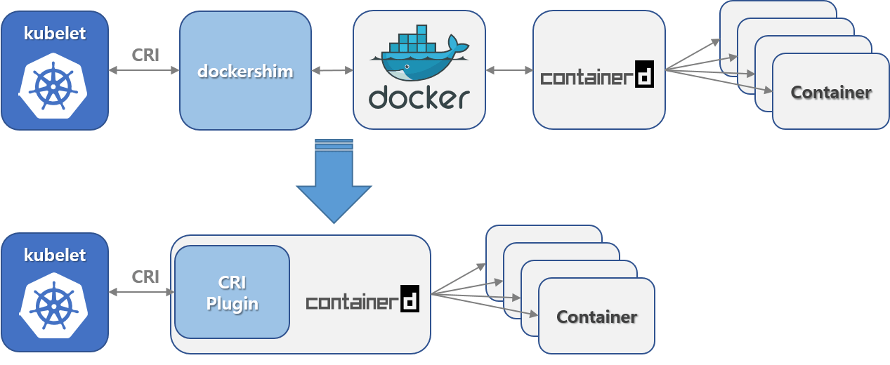

## change container runtime docker to containerd





### check the k8s node first (it'll show k8s version details, Node's IP and CONTAINER-RUNTIME, etc)
```
kubectl get nodes -o wide
```

### check containerd namespae
```
ctr namespace list
```
```
ctr --namespace moby container list
```
### Cordon the node
```
kubectl cordon
```
### Drain the node
```
kubectl drain <node-name> --ignore-daemonsets --force --delete-local-data
```
if node is not drain or showing the error something like istiod or istio-ingress pod still pending use below setp

#### Check istio pod and delete them

```
kubecctl -nistio-system get pods -owide
```

```
kubectl -nistio-system delete pod {istiod and istio-ingress pods name}
```
### login to node via ssh

```
ssh username@node1
```
### stop kubelet service
```
systemctl stop kubelet
```
### stop docker service
```
systemctl stop docker
```
### remove or uninstall docker-ce from node
```
apt purge docker-ce docker-ce-cli
```
### edit the containerd config
```
vim /etc/containerd/config.toml
```
### disable the disabled_plugins for cri
```
#disabled_plugins = ["cri"]
```
### restart containerd service
```
systemctl restart containerd
```
### edit kubeadm-flag.env file
```
vim /var/lib/kubelet/kubeadm-flags.env
```
#### comment with # for below line
```
KUBELET_KUBEADM_ARGS="--network-plugin=cni --pod-infra-container-image=k8s.gcr.io/pause:3.4.1"
```

#### add below line in env file

```
KUBELET_KUBEADM_ARGS="--cgroup-driver=systemd --network-plugin=cni --pod-infra-container-image=k8s.gcr.io/pause:3.4.1 --resolv-conf=/run/systemd/resolve/resolv.conf --container-runtime=remote --container-runtime-endpoint=unix:///run/containerd/containerd.sock"
```
### restart kubelet service
```
systemctl start kubelet
```
### reboot the node
```
reboot
```
### Uncordon the node
```
kubectl uncordon <node-name>
```

### check the container runtime
```
kubectl get nodes -o wide
```

[Click here for Ref URL](https://kruyt.org/migrate-docker-containerd-kubernetes/)

author @yannainglin


